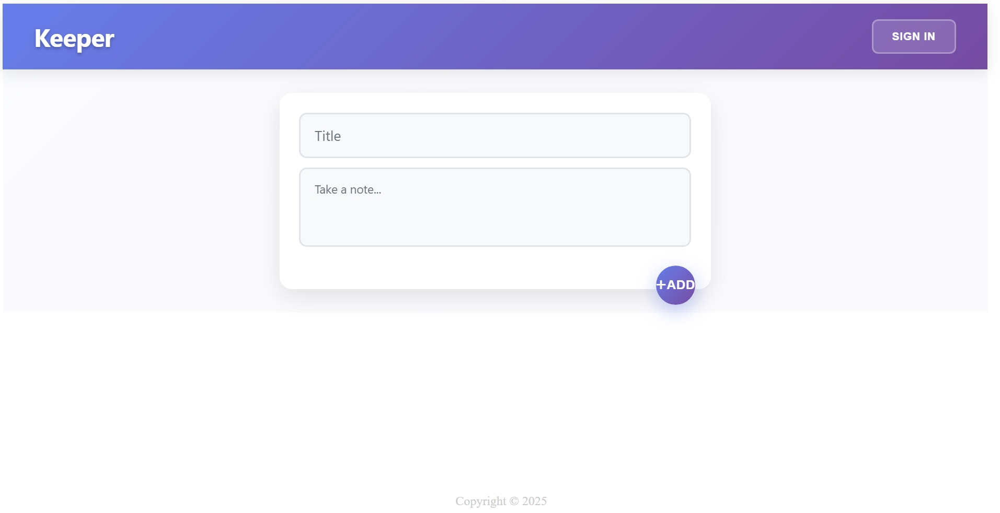

# Keeper

A modern note-keeping web application built with React, Express, and PostgreSQL.

## Prerequisites

1. **Install Node.js (with npm)**
   - Download and install Node.js from the official website: [https://nodejs.org/](https://nodejs.org/)
   - npm is included with Node.js.

2. **Install PostgreSQL**
   - Download and install PostgreSQL from: [https://www.postgresql.org/download/](https://www.postgresql.org/download/)
   - During installation, set a password for the default `postgres` user and remember it.
   - Make sure PostgreSQL is running and you can connect using pgAdmin or the command line.

3. **Create Database and Tables**
   - Open `psql` or pgAdmin and run:
     ```sql
     CREATE DATABASE keeper;
     \c keeper
     CREATE TABLE users (
       id SERIAL PRIMARY KEY,
       email VARCHAR(255) UNIQUE NOT NULL,
       password VARCHAR(255) NOT NULL,
       first_name VARCHAR(100) NOT NULL,
       middle_name VARCHAR(100),
       last_name VARCHAR(100) NOT NULL
     );
     CREATE TABLE notes (
       id SERIAL PRIMARY KEY,
       user_id INTEGER REFERENCES users(id),
       title VARCHAR(255) NOT NULL,
       content TEXT NOT NULL,
       created_at TIMESTAMP NOT NULL
     );
     ```
   - Adjust table fields as needed for your use case.

## Installing the Project

1. **Clone the repository**
   ```sh
   git clone <your-repo-link>
   cd keeper
   ```

2. **Install dependencies**
   ```sh
   npm install
   ```

3. **Create a `.env` file**
   - Place this file in the project root (where `index.html` is located).
   - Example format:
     ```env
     PORT=3000
     USER=postgres
     HOST=localhost
     DATABASE=keeper
     PASSWORD=PasswordToDatabase
     DBPORT=5432
     SECRET=SecretExample
     ReactPort=5173
     ```
   - Replace values with your actual database credentials and desired ports.

4. **Configure Vite Proxy**
   - Your `vite.config.js` should look like:
     ```js
     import { defineConfig } from 'vite'
     import react from '@vitejs/plugin-react-swc'

     export default defineConfig({
       plugins: [react()],
       server: {
         proxy: {
           '/api': {
             target: 'http://localhost:3000',
             changeOrigin: true
           }
         }
       }
     })
     ```
   - This allows your React frontend to communicate with the Express backend during development. The '3000' is the port number the server will be running on. If the port number for server is different, change it accordingly. 

5. **Start the Backend Server**
   ```sh
   node 'server file name'
   ```
   - Or use your preferred method to start the Express server.

6. **Start the React Frontend**
   ```sh
   npm run dev
   ```
   - By default, Vite runs on port 5173. Make sure this matches your `.env` ReactPort value.

## Additional Configuration

- Make sure your PostgreSQL server is running before starting the backend.
- If you change database credentials, update both `.env` and your database setup.
- For production, set secure values for `SECRET` and use environment variables for sensitive data.
- You may need to allow CORS for your frontend port in the Express server.
- If you encounter issues, check your terminal for error messages and verify all services are running.

## Features
- User authentication (register, login, session management)
- Create, view, and delete notes
- Change password and update user info
- Modern UI with responsive design

### App Screenshots & User Experience

#### 1. Home Page (Not Signed In)
When you first open Keeper, you'll see the home page. At the top, there's a bar with a login button. You won't be able to create notes until you sign in. If you try to create a note, the app will kindly remind you to log in or create an account.



#### 2. Login Page
This is where you enter your email and password to access your account. It's simple and secure.


#### 3. Register Page
Here you can sign up for a new account by entering your details. The app helps you out—if you accidentally enter something that doesn't make sense (like numbers in your name), you'll get a friendly message asking you to fix it.


#### 4. Home Page (After Logging In)
Once you're logged in or registered, the top bar changes to welcome you back and gives you access to manage your account settings. You can now create and manage your notes easily.


#### 5. Account Page
On the account page, you'll see your user information: ID, email, first name, middle name, and last name. You can also change your password—just click the button and a form will appear. There's also a button to delete all your notes if you ever want a fresh start. 

##### Note: Error is shown because I had not connected a database in this image. I hardcoded the authentication in order to show the account page without having to sign in.


## Troubleshooting
- If you see database connection errors, verify your `.env` values and PostgreSQL status.
- For frontend/backend communication issues, check the Vite proxy and port settings.
- For any other errors, review logs and error messages for guidance.

## License
MIT

---

For questions or help, feel free to open an issue or contact the project owner.
